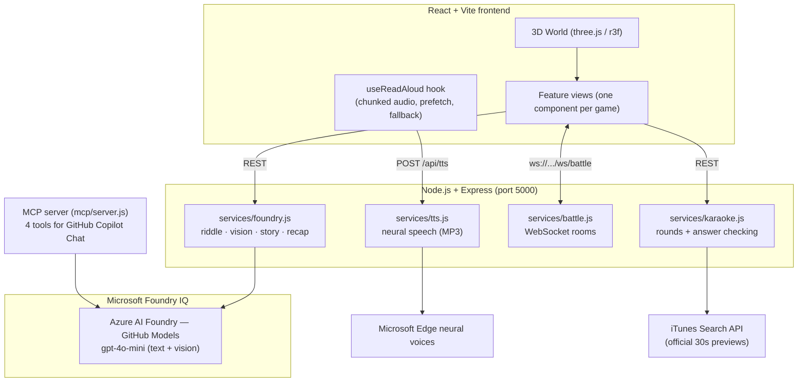

# Agent League — AI-Powered Learning & Creativity World

> **Microsoft Agents League @ AISF 2026 — Battle #1: Creative Apps with GitHub Copilot**
> Submitted by Htet-Myark · License: MIT

A gamified learning platform set on an explorable **3D island**. Walk your character to a building and step inside: certification exam practice, an AI bedtime storyteller that reads aloud with a neural voice, 3-minute AI movie recaps, real-time multiplayer word battles across devices, a song-guessing game, sleep sounds, and a full kids section — no account required, works instantly in the browser.

---

## The 3D World

The landing page is a low-poly 3D island built with **Three.js / react-three-fiber** — every feature is a building you walk to:

| Station | Feature |
|---|---|
| Exam Academy | Certification exam practice |
| Sleep Cabin | Generated ambient sleep sounds |
| Recap Cinema | 3-minute AI movie recaps |
| Karaoke Stage | Blind Karaoke song-guessing game |
| Kids Playground | Kids games and the bedtime storyteller |

- **Desktop**: WASD / arrow keys to walk, Space to jump, Enter to enter a glowing station
- **Mobile**: virtual joystick + jump button, or tap anywhere to walk there
- **Physics**: solid collision on trees, rocks, and buildings (slide along edges); rocks are low enough to jump over
- Exiting a feature respawns your character in front of the building you entered

---

## Features

### Exams
50 randomised questions per session with full answer review and explanations: **AWS Cloud Practitioner · Azure Fundamentals · Kubernetes Basics · Docker Essentials**.

### Sleep Sounds (Adults)
Five looping ambient sounds — rain, ocean waves, white noise, deep rumble, fan hum — **synthesized live in the browser with the Web Audio API** (no audio files: filtered pink/brown noise, LFO wave swells). Volume control and an auto-stop sleep timer (15/30/60 min) with live countdown.

### 3-Minute Movie Recap  Foundry IQ
Type any movie title → the AI writes a ~3-minute spoken recap in **simple/intermediate English (CEFR A2-B1)** for language learners, then reads it aloud with a neural narrator voice. Every recap shows a **confidence badge** (high / medium / low) — the model rates how well it actually knows the film, an explicit anti-hallucination signal. Unknown titles are declined rather than invented.

### Blind Karaoke
Hear a **10-second clip** of a popular song (official iTunes previews — ~75 well-known songs across decades) and guess the title. 5 rounds, a running timer, and a **persistent best record** (score + time). The answer never leaves the server until you guess right or give up — no cheating via dev tools.

### Word Battle — Real-Time Multiplayer (different devices!)
Battle a friend over **WebSockets**: create a room, share the 4-letter code, and your friend joins from their own device on the same Wi-Fi (the waiting room shows the exact URL to open). Answer word clues to deal damage — first to knock the opponent's 100 HP to zero wins. Server-authoritative game logic, rematch handshake, and disconnect handling.

### Kids Section
| Game | What it does |
|---|---|
| **Pronunciation Obstacle Course** | Say words aloud to clear obstacles — Web Speech API, 112-word pool |
| **AI Riddle Challenge**  Foundry IQ | Fresh riddle every play, any topic, with child-friendly explanation |
| **Photo Challenge**  Foundry IQ Vision | "Find and photograph a mirror" → camera snap → vision model verdict + confidence |
| **Logo Guesser** | Name the brand from its icon, alias-aware matching |
| **Bedtime Story Teller**  Foundry IQ | Answer 5 personality questions → AI writes a ~10-minute bedtime story → **read aloud paragraph-by-paragraph with a neural voice**, live highlight following the narration |

---

## Architecture



### Tech Stack

| Layer | Technology |
|---|---|
| Frontend | React 18, Vite, Three.js + @react-three/fiber + drei |
| Backend | Node.js, Express, `ws` WebSockets |
| AI | **Foundry IQ** — Azure AI Foundry via GitHub Models, `gpt-4o-mini` text + vision |
| Speech out | `msedge-tts` neural voices (server-side MP3) + browser speechSynthesis fallback |
| Speech in | Web Speech API (pronunciation game) |
| Generated audio | Web Audio API (sleep sounds — no audio assets) |
| MCP | `@modelcontextprotocol/sdk` |

---

## Microsoft Foundry IQ Integration

All AI features connect to **Foundry IQ** (Azure AI Foundry via the GitHub Models endpoint) through one shared client in `server/services/foundry.js`:

```js
const client = new OpenAI({
  baseURL: 'https://models.inference.ai.azure.com',
  apiKey: process.env.GITHUB_TOKEN,
});
```

| Endpoint | Model | What it does |
|---|---|---|
| `POST /api/foundry/riddle` | `gpt-4o-mini` | Structured riddle (prompt, answer, explanation) on a topic |
| `POST /api/foundry/classify` | `gpt-4o-mini` vision | Classifies a camera photo against an expected object — match + confidence |
| `POST /api/foundry/story` | `gpt-4o-mini` | **Two-call pipeline**: writes a bedtime story in halves so it reliably reaches ~10 read-aloud minutes |
| `POST /api/foundry/recap` | `gpt-4o-mini` | Movie recap in learner-level English with a self-rated **confidence level** |
| `POST /api/foundry/logo-hint` | `gpt-4o-mini` | Describes a logo without naming the brand |

Grounding & anti-hallucination measures: riddles return a cited `source`; recaps self-rate confidence and refuse unknown titles (`known: false`); the vision classifier returns calibrated confidence. All non-AI features work without a token configured.

---

## Reasoning & Multi-Step Pipelines

- **Bedtime story generation** is a two-call conversation: the model writes the first 8 paragraphs, receives its own output back, and continues to a sleepy ending — single calls consistently undershot the 10-minute target, so generation is split and stitched.
- **Read-aloud** is a streaming pipeline: each paragraph is synthesized to MP3 on the server, played in order while the *next* paragraph is prefetched, cached for instant replay, with automatic fallback to the browser's built-in voice if the neural endpoint fails.
- **Photo Challenge** chains camera capture → canvas JPEG encode → base64 upload → vision classification → structured verdict.
- **Word Battle** keeps all game state server-side: the server picks words, validates answers, applies damage, and broadcasts state — clients only render.
- **Blind Karaoke** rounds are server-side sessions with TTL: the browser receives only a preview URL and a round ID; guesses are normalized and matched server-side (case, punctuation, "feat." suffixes).

---

## Reliability & Safety

- **Secrets**: `GITHUB_TOKEN` lives in `server/.env` (gitignored, never committed — verified against full git history); all AI calls are server-side; the client never sees the token
- **Input validation**: TTS voice/rate whitelisted server-side; text length caps; karaoke/battle answers validated server-side so clients can't cheat
- **Graceful degradation**: neural TTS falls back to browser speechSynthesis; DB falls back to in-memory store; AI features show friendly setup hints when unconfigured; every fetch has explicit error states
- **Kids-safe generation**: story and riddle prompts enforce age-appropriate, gentle content (no scary moments, calm endings)
- **Resource cleanup**: camera, microphone, audio contexts, and WebSockets are all torn down on navigation

---

## MCP Server — GitHub Copilot Integration

Agent League ships an **MCP server** that connects its Foundry IQ features directly into GitHub Copilot Chat in VS Code, registered automatically via `.vscode/mcp.json`:

| Tool | Ask Copilot |
|---|---|
| `generate_riddle` | *"Generate a riddle about space"* |
| `generate_logo_hint` | *"Give me a logo hint for Nike"* |
| `list_exams` | *"What exams are available?"* |
| `foundry_status` | *"Is Foundry IQ configured?"* |

Test from a terminal: `echo '{"jsonrpc":"2.0","id":1,"method":"tools/list","params":{}}' | node mcp/server.js`

---

## GitHub Copilot Usage

GitHub Copilot was used throughout the development of this project:

- **Game logic** — Copilot completed the speech recognition continuous-restart loop (`onend` handler), the photo capture canvas pipeline, and the pronunciation game state machine
- **Foundry IQ prompts** — Copilot suggested the system prompt structure for the riddle generator and image classifier, and helped shape the JSON response schemas to be reliably parseable
- **MCP server** — Copilot generated the Zod input schemas and tool handler boilerplate for each of the four MCP tools
- **Debugging** — Copilot Chat identified the root cause of the SVG logo rendering issue (CSS `filter: brightness(0) invert(1)` fix) and the speech recognition permission error handling
- **CSS animations** — Copilot completed the `@keyframes` for `flashCorrect`, `flashWrong`, `celebPop`, and `micPulse` from short descriptions
- **API design** — Copilot proposed the REST endpoint structure for the Foundry IQ features, including the base64 image payload format for the vision endpoint

---

## Local Setup

### Prerequisites
- Node.js 18+
- A GitHub Personal Access Token (classic, no scopes) for GitHub Models — free accounts included

### Run it
```bash
git clone <your-repo-url>
cd agent-league
npm install                                  # installs client, server, and mcp workspaces
echo "GITHUB_TOKEN=ghp_your_token" > server/.env
npm run dev
```

| Service | URL |
|---|---|
| Frontend | http://localhost:3000 |
| Backend + WebSocket | http://localhost:5000 |

> **Multiplayer across devices**: both devices on the same Wi-Fi — the Word Battle waiting room displays the exact `http://<your-ip>:3000` address for the second device. Allow Node.js through Windows Firewall when prompted.
> **Browser**: use Chrome or Edge for the voice features (Web Speech API).

---

## Project Structure

```
agent-league/
├── client/
│   └── src/
│       ├── App.jsx                  # View routing only
│       ├── components/              # One component per feature
│       │   ├── WorldMap.jsx         # 3D island, player physics, joystick
│       │   ├── StoryTeller.jsx      # Bedtime story + read-aloud
│       │   ├── MovieRecap.jsx       # Recaps + confidence badge
│       │   ├── WordBattle.jsx       # Multiplayer over WebSocket
│       │   ├── BlindKaraoke.jsx     # Song guessing + time record
│       │   ├── SleepSounds.jsx      # Web Audio synthesis
│       │   └── ...                  # Quiz, ExamList, KidsMenu, games
│       ├── hooks/useReadAloud.js    # Shared neural TTS playback pipeline
│       └── data/                    # Word lists, brands
├── server/
│   ├── server.js                    # REST routes + HTTP/WS server
│   ├── services/
│   │   ├── foundry.js               # Foundry IQ: riddle · vision · story · recap
│   │   ├── tts.js                   # Neural speech synthesis
│   │   ├── battle.js                # Multiplayer rooms (ws)
│   │   └── karaoke.js               # Song rounds + guess matching
│   └── data/                        # Exam questions, battle words
├── mcp/server.js                    # MCP server for GitHub Copilot
└── .vscode/mcp.json                 # Copilot MCP registration
```

---

## Contest Compliance

| Requirement | Status |
|---|---|
| Public GitHub repository + README | Yes |
| Architecture diagram | Yes — Mermaid diagram above |
| GitHub Copilot usage documented | Yes |
| Microsoft IQ — **Foundry IQ** | Yes — 5 endpoints: riddles · vision · stories · recaps · hints |
| MCP Server for Copilot | Yes — 4 tools via `.vscode/mcp.json` |
| Creative application | Yes — gamified 3D learning world |
| Demo video (max 5 min, YouTube/Vimeo) | Link to be added before submitting |
| Track | Battle #1 — Creative Apps |

---

## License

MIT — see [LICENSE](LICENSE) for full text.
